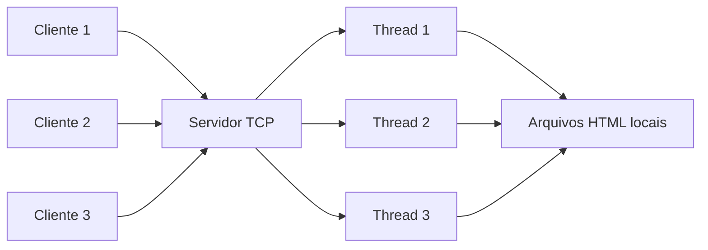

# Modelo de Apresentacao

Tema: Servidor Web Simplificado com Sockets e Threads

## Slide 1: Titulo

**Servidor Web Simplificado**

Aplicacao cliente-servidor com sockets TCP e atendimento simultaneo usando threads.

Fala sugerida:

> Neste trabalho, desenvolvemos um servidor web simplificado em Python. O objetivo foi aplicar conceitos de Redes de Computadores, especialmente comunicacao cliente-servidor, sockets, protocolo de aplicacao e concorrencia com threads.

## Slide 2: Contexto da Atividade

Pontos para o slide:

- Paradigma cliente-servidor;
- comunicacao via sockets;
- multiplos clientes simultaneos;
- protocolo definido pela aplicacao;
- leitura e envio de paginas HTML locais.

Fala sugerida:

> A atividade propunha a construcao de uma aplicacao distribuida. Nosso grupo escolheu o tema de servidor web simplificado, no qual clientes solicitam arquivos HTML e o servidor responde com o conteudo correspondente.

## Slide 3: Objetivo do Projeto

Pontos para o slide:

- Receber requisicoes de clientes;
- interpretar comandos `GET`;
- localizar arquivos no servidor;
- retornar respostas HTTP simples;
- atender varios clientes ao mesmo tempo.

Fala sugerida:

> O objetivo foi criar um servidor capaz de receber uma requisicao indicando o arquivo desejado, buscar esse arquivo localmente e devolver uma resposta ao cliente. Para permitir varios acessos simultaneos, cada conexao e tratada em uma thread separada.

## Slide 4: Arquitetura Cliente-Servidor

Diagrama sugerido:



Fala sugerida:

> O servidor fica escutando em um endereco IP e uma porta. Quando um cliente se conecta, o servidor aceita a conexao e cria uma thread para processar aquela requisicao. Assim, o loop principal pode continuar aceitando novos clientes.

## Slide 5: Tecnologias Utilizadas

Pontos para o slide:

- Python 3;
- biblioteca `socket`;
- biblioteca `threading`;
- protocolo HTTP simplificado;
- arquivos HTML locais.

Fala sugerida:

> O projeto foi feito somente com bibliotecas padrao do Python. A biblioteca `socket` foi usada para a comunicacao TCP, enquanto `threading` permitiu criar uma thread para cada cliente conectado.

## Slide 6: Protocolo de Comunicacao

Pontos para o slide:

Requisicao:

```http
GET /index.html HTTP/1.1
Host: 127.0.0.1
```

Resposta de sucesso:

```http
HTTP/1.1 200 OK
Content-Type: text/html; charset=utf-8
```

Resposta de erro:

```http
HTTP/1.1 404 Not Found
Content-Type: text/html; charset=utf-8
```

Fala sugerida:

> Nosso protocolo segue uma versao simplificada do HTTP. O cliente envia um comando `GET` informando o caminho do arquivo. O servidor interpreta essa linha, procura o arquivo e responde com um codigo de status, como `200 OK` ou `404 Not Found`.

## Slide 7: Funcionamento do Servidor

Pontos para o slide:

1. Cria socket TCP.
2. Associa IP e porta.
3. Aguarda conexoes.
4. Aceita cliente.
5. Cria uma thread.
6. Processa a requisicao.
7. Envia resposta.
8. Fecha a conexao.

Fala sugerida:

> O servidor executa continuamente esperando conexoes. Quando um cliente se conecta, a funcao `accept` retorna um novo socket para esse cliente. Esse socket e passado para uma thread, que fica responsavel por receber a requisicao, montar a resposta e fechar a conexao.

## Slide 8: Concorrencia com Threads

Pontos para o slide:

- Sem threads: um cliente por vez;
- com threads: varios clientes em paralelo;
- cada thread trata uma conexao;
- o servidor principal continua aceitando novas conexoes.

Fala sugerida:

> A principal melhoria em relacao a um servidor sequencial e o uso de threads. Se o servidor atendesse um cliente por vez, uma requisicao lenta poderia atrasar todas as outras. Com threads, cada cliente e tratado de forma independente.

## Slide 9: Tratamento de Erros

Pontos para o slide:

- Arquivo encontrado: `200 OK`;
- arquivo inexistente: `404 Not Found`;
- requisicao invalida: `400 Bad Request`;
- fechamento da conexao no bloco `finally`.

Fala sugerida:

> O servidor tambem trata situacoes de erro. Quando o arquivo solicitado nao existe, ele retorna uma pagina 404 personalizada. Quando a requisicao nao segue o formato esperado, o servidor retorna uma resposta de erro. Ao final, a conexao e sempre fechada.

## Slide 10: Cliente de Testes

Pontos para o slide:

- Simula varios clientes;
- cada cliente roda em uma thread;
- envia requisicoes para paginas diferentes;
- imprime o status retornado pelo servidor.

Fala sugerida:

> Para demonstrar o funcionamento concorrente, criamos um cliente de testes. Ele inicia varias threads, e cada uma simula um cliente fazendo uma requisicao ao servidor. Assim conseguimos observar varias conexoes sendo processadas quase ao mesmo tempo.

## Slide 11: Testes Realizados

Pontos para o slide:

- `/index.html`: retorna `200 OK`;
- `/sobre.html`: retorna `200 OK`;
- `/`: retorna `index.html`;
- `/nao_existe.html`: retorna `404 Not Found`;
- 10 clientes simultaneos: todos recebem resposta.

Fala sugerida:

> Os testes validam os principais requisitos da atividade: comunicacao basica, busca de arquivos, tratamento de erro e concorrencia. O teste com 10 clientes mostra que o servidor consegue lidar com multiplas conexoes.

## Slide 12: Relacao com Redes de Computadores

Pontos para o slide:

- Camada de aplicacao: protocolo HTTP simplificado;
- camada de transporte: TCP;
- sockets como interface entre aplicacao e rede;
- modelo cliente-servidor;
- concorrencia em servidores reais.

Fala sugerida:

> O projeto se relaciona diretamente com conceitos de Redes. Na camada de aplicacao, definimos mensagens de requisicao e resposta. Na camada de transporte, usamos TCP para garantir uma comunicacao confiavel. Os sockets funcionam como a interface entre o programa e os servicos de rede do sistema operacional.

## Slide 13: Possiveis Melhorias

Pontos para o slide:

- Cabecalhos HTTP mais completos;
- `Content-Length`;
- seguranca contra acesso fora da pasta;
- suporte a CSS, JS e imagens;
- logs mais detalhados;
- testes automatizados.

Fala sugerida:

> Apesar de o servidor cumprir a proposta, existem melhorias possiveis para aproximar o projeto de um servidor web real. Entre elas estao cabecalhos HTTP mais completos, protecao de caminhos de arquivo, suporte a outros tipos de arquivo e testes automatizados.

## Slide 14: Conclusao

Pontos para o slide:

- O sistema implementa cliente-servidor;
- usa sockets TCP;
- define um protocolo simples;
- manipula arquivos locais;
- atende multiplos clientes com threads;
- demonstra conceitos fundamentais de Redes.

Fala sugerida:

> Como conclusao, o projeto demonstra na pratica como uma aplicacao de rede funciona. O servidor recebe requisicoes, processa mensagens de acordo com um protocolo, acessa recursos locais e responde aos clientes. O uso de threads permite que esse atendimento seja concorrente, como ocorre em muitos sistemas reais.

## Roteiro rapido para demonstracao ao vivo

1. Abrir a pasta do projeto.
2. Executar:

```bash
python server.py
```

3. Acessar no navegador:

```text
http://localhost:8080/
```

4. Acessar:

```text
http://localhost:8080/sobre.html
```

5. Acessar um arquivo inexistente:

```text
http://localhost:8080/nao_existe.html
```

6. Em outro terminal, executar:

```bash
python client.py
```

7. Mostrar no terminal do servidor as conexoes e threads ativas.

